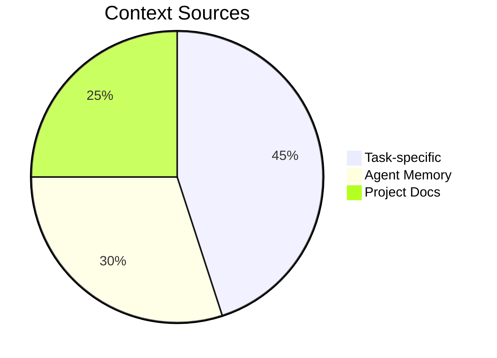

# Context Guardian Agent

## Responsibilities
1. Context priority management
2. Conflict resolution
3. Context tagging validation

## Decision Matrix
```python
def calculate_context_priority(
    relevance: float,
    freshness: float,
    authority: float
) -> float:
    """Calculates context weight score"""
    return (relevance * 0.6) + (freshness * 0.3) + (authority * 0.1)

## Conflict Protocol
1. Detect conflicting guidelines
2. Check version timestamps
3. Escalate to ArchitectureAgent if unresolved

## Monitoring Dashboard
